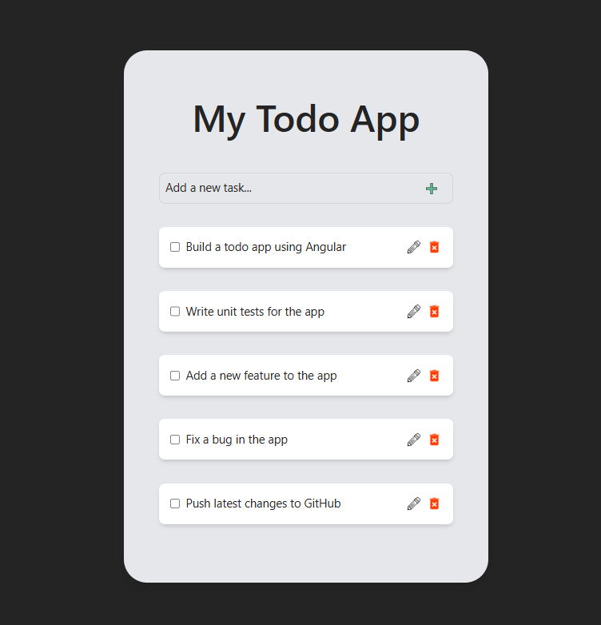

# My Todo App 📝

A simple todo list application built with Angular standalone components and reactive signals. It lets users create, complete, edit and delete tasks with a clean user interface powered by Tailwind CSS.



---

## 🛠 Built With

- [Angular 19](https://angular.dev)
- [TypeScript](https://www.typescriptlang.org/)
- [Tailwind CSS](https://tailwindcss.com/)
- [Signals & Reactive State](https://angular.dev/guide/signals)

---

## 🚀 Getting Started

### Prerequisites

- [Angular CLI](https://angular.io/cli) installed globally:

  ```sh
  npm install -g @angular/cli
  ```

### Installation

1. **Clone the repository:**

   ```sh
   git clone git@github.com:HeidiDragomir/to-do-app-angular.git
   ```

2. **Navigate to the project folder:**

   ```sh
   cd todo-app-angular
   ```

3. **Install dependencies:**

   ```sh
   npm install
   ```

4. **Start the dev server:**

   ```sh
   ng server
   ```

5. **Open in browser:**

   Visit [http://localhost:4200](http://localhost:4200) to view the app.

---
